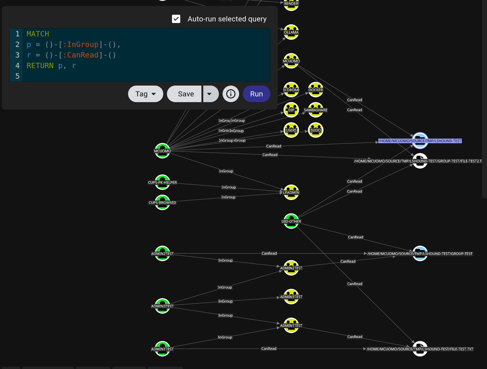

# lshound

This is a package that is used to map out the ACLs of the filesystem on a Unix based OS. You can use this software to generate the OpenGraph representation of a filesystem to see how the files may interact with each other, and what type of control users and groups have. Some other properties of the file system are also collected.

#### Requirements

go version 1.25
OS: Unix based

To install this program, go version 1.25 is required to build. Once this and GOPATH is properly set up, go install could be run. 

#### Install

`go install github.com/mykeelium/lshound@latest`

#### Usage

lshound can be used to walk through directories and collect information about the files, directories and system links that are present in the path recursively. A file is created to be imported into BloodHound.

lshound can also also be used by piping in the value of a find command, rather than letting lshound walk directories. This can be done with a command such as:

`sudo find /etc -type f | lshound -stdout > output.json`

##### Example

As a simplest example, in this state, a document and a directory exists that are owned by `admin1Test` and `admin2Test` respectively. However, because the user `admin3Test` is in the groups `admin1Test` and `admin2Test` it has access to these files and directories. This can be mapped out using BloodHound to show this relationship.



##### Command Line Arguments

```text
Usage: lshound [Arguments]

Arguments:
    -path <path>        Path to where to recursively walk down files                
        | Default: .
    -skip-acl           Collect the ACL information about the file, set this value to skip.
        | Default: false
    -follow-symlink     While doing the walk, whether or not to follow symlinks     
        | Default: false
    -max-depth <depth>  Max recursive depth relative to start (-1 = unlimited)      
        | Default: -1
    -stdout             Whether or not to output to standard out                    
        | Default: false
    -basecollection     Whether or not to map the collected data to an OpenGraph representation. If set, outputs the base collection objects.
        | Default: false
    -output <fileName>  Specify the file name to output to if not output to stdout  
        | Default: output
```
